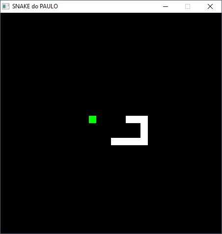

# Snake game clone in Pygame (Python SDL)

Video preview: https://youtu.be/uaXgmDN2RYQ

I made this when I was studying Pygame almost 2 decades ago: it is a clone of the Snake game, done in Python with the SDL library Pygame. Note: it works, but I never finished it (no score count, no boundaries logic, no start or end screen). 

Note: 15 years later, this code is hugly and there are better approaches :) 

Everyone can use this in any way they like, I don't care about licenses or copyright, just have fun.

##How to run:
Run main.py via python2 (yea, no one uses Python2 noadays, maybe py3 would still work? Never ran it).

##How to play:
Use the arrow keys (up, right, down, left) to control the movement, catch the green squares to grow, if you touch anything else you loose.

##Contacts:
My Homepage: [www.paulojorgepm.net](http://www.paulojorgepm.net)
